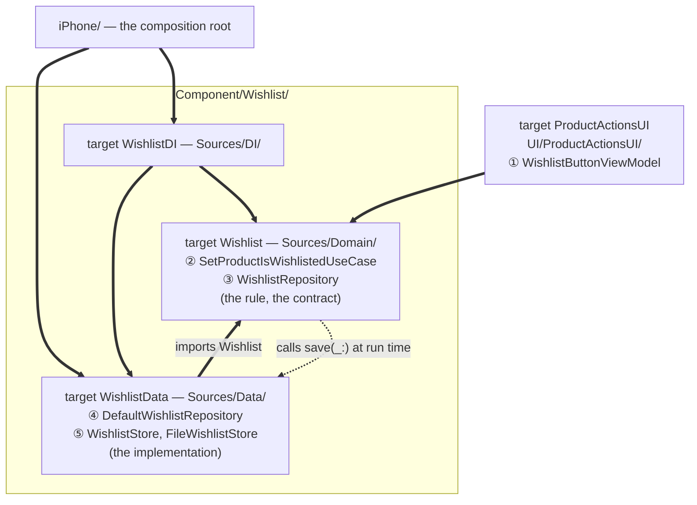

# Clean Architecture for iOS

A shopping app built the way Robert C. Martin's *Clean Architecture* describes, in SwiftUI, with every architectural boundary enforced by the Swift compiler rather than by good intentions.

This page teaches the architecture by following **one tap through every layer**. It is about twenty minutes. When you finish it you will have seen every idea the project uses, working, in one feature — and you can read the rest of the code without a map.

The complete layer-by-layer reference is in [docs/architecture.md](docs/architecture.md). Come here first.

---

## The one idea

Everything below follows from a single rule:

> *"Source code dependencies must point only inward, toward higher-level policies."*
> — Robert C. Martin, *Clean Architecture* (2017), Chapter 22

```
Presentation ──▶ Domain ◀── Data
     └──────────────────────────▶ (never)
```

The domain — the business rules — is in the middle and depends on nothing. The screen depends on it. The database depends on it. Neither of them can be depended upon *by* it.

That is the whole architecture. The rest is mechanics for keeping it true when nobody is watching.

---

## The walkthrough: a shopper taps the heart

A shopper is looking at a product and taps the heart to save it. Follow that tap.

Five files, in the order the tap reaches them:

```
      tap
       │
       ▼
 ①  WishlistButtonViewModel      UI/ProductActionsUI     presentation
       │  calls a use case protocol
       ▼
 ②  SetProductIsWishlistedUseCase Component/Wishlist     domain  ── the rule
       │  calls a repository protocol
       ▼
 ③  WishlistRepository           Component/Wishlist      domain  ── the contract
       ┆  ...is implemented by
       ▼
 ④  DefaultWishlistRepository    Component/Wishlist      data    ── the detail
       │
       ▼
 ⑤  WishlistStore                                        disk
```

Note where the line at ③ falls. The contract is in the **domain**; the thing that satisfies it is in **data**. That is why the arrow between them points *up* the page while the call goes *down* it. Hold on to that — it is the only part of this that is counter-intuitive, and it is the part that makes everything else possible.

### ① The screen knows one thing: that something can be added

**[`UI/ProductActionsUI/Sources/UI/Buttons/Wishlist/WishlistButtonViewModel.swift`](UI/ProductActionsUI/Sources/UI/Buttons/Wishlist/WishlistButtonViewModel.swift)**
```swift
@Observable
public final class WishlistButtonViewModel {
    private(set) var isInWishlist = false

    private let setProductIsWishlisted: SetProductIsWishlistedUseCase
    private let authPresenter: AuthPresenting
    private let snackbarPresenter: SnackbarPresenting
```

Read what it holds. Not a repository. Not a network client. Not a database. Three protocols, each one a capability it actually calls — plus the fourth it subscribed to in its initialiser to know whether the heart is filled.

This is the first payoff, and it is worth stating plainly: **to test this button you need no network, no disk and no simulator.** You need four small conforming structs. That is not a testing trick — it falls out of the button never having been given anything bigger than what it uses.

The view above it is thinner still. It binds to `isInWishlist` and calls `didTap()`. There is no branch in it worth testing.

### ② The rule lives in the domain, once

The tap becomes a call to a use case. Here is the whole of it:

**[`Component/Wishlist/Sources/Domain/UseCases/Impl/DefaultSetProductIsWishlistedUseCase.swift`](Component/Wishlist/Sources/Domain/UseCases/Impl/DefaultSetProductIsWishlistedUseCase.swift)**
```swift
public struct DefaultSetProductIsWishlistedUseCase: SetProductIsWishlistedUseCase {
    private let repository: WishlistRepository
    private let getSession: GetSessionUseCase

    @MainActor
    public func callAsFunction(
        productId: ProductID,
        isWishlisted: Bool
    ) async -> Result<Void, WishlistError> {
        guard getSession().isLoggedIn else {
            return .failure(.unauthenticated)
        }

        let wishlist = repository.wishlist
        let updated = isWishlisted
            ? wishlist.adding(WishlistItem(productId: productId))
            : wishlist.removing(productId: productId)

        do {
            try await repository.save(updated)
            return .success(())
        } catch {
            return .failure(.unavailable)
        }
    }
}
```

Four things are happening, and each one is a decision you could have made differently.

**One use case with a state, not one for saving and another for unsaving.** Saving and unsaving differ in a single side-effect-free call on the aggregate; everything around it — who may do it, what a refused write means — is the same rule written twice. Split in two, the button would have to hold both and work out which of them its own current state implied, which is a toggle re-derived from the thing it is toggling. `ObserveProductIsWishlistedUseCase` reports it and this sets it, and the pair reads as one fact about a product.

**"You must be signed in to save something" is a business rule, so it is in the domain.** It is not in the button. A second screen that saves a product cannot forget it, because forgetting it is not available to them — they call this, and this checks. Put that guard in the button instead and the rule is now in as many places as there are buttons, which is how a rule quietly becomes untrue.

**The rule needs the session, so `Wishlist` depends on `Session`.** A domain component depending on another domain component is allowed and is the point: requiring an account is business, not plumbing.

**The failure is in the shopper's vocabulary, not the disk's.** `WishlistError` has exactly two cases:

```swift
public enum WishlistError: Error, Equatable, Sendable {
    case unauthenticated
    case unavailable
}
```

A disk that would not write, a request that never arrived and a payload that came back unreadable all become `.unavailable` — because to a shopper they are one fact: *the wishlist did not change*. Nothing in the domain would act differently on the difference, so preserving it would only carry the transport's vocabulary inward.

### ③ The contract belongs to the domain

The use case calls `repository.save(...)`. That protocol is declared **in the domain**, beside the use case that needs it:

**[`Component/Wishlist/Sources/Domain/Repository/WishlistRepository.swift`](Component/Wishlist/Sources/Domain/Repository/WishlistRepository.swift)**
```swift
public protocol WishlistRepository: Sendable {
    @MainActor var wishlist: Wishlist { get }
    @MainActor var wishlistPublisher: AnyPublisher<Wishlist, Never> { get }

    /// Throws when the list could not be kept, so a caller cannot report a change that did not
    /// happen. What is published is what was kept.
    @MainActor
    func save(_ wishlist: Wishlist) async throws
}
```

**This is the inversion, and this is the sentence to remember: the domain states what it needs, and the data layer is written to fit.** The domain is not a client of storage. Storage is a plugin to the domain.

Read the doc comment on `save`. It is part of the contract, not decoration — it says the method throws rather than failing quietly, *so that a caller cannot report a change that did not happen*. Any implementation that swallowed a write failure would satisfy the compiler and break that promise, and the shopper would be told their wishlist changed when it did not.

### ④ The detail satisfies the contract

**[`Component/Wishlist/Sources/Data/DefaultWishlistRepository.swift`](Component/Wishlist/Sources/Data/DefaultWishlistRepository.swift)**
```swift
public func save(_ wishlist: Wishlist) async throws {
    try await store.setItems(wishlist.items, for: owner)
    subject.value = wishlist
}
```

Two lines, in this order, deliberately: write first, then publish. Publish first and a failed write would leave every screen showing an item that is not saved.

Now the structural claim — and you can check it yourself:

```
Component/Wishlist/
├── Sources/
│   ├── Domain/     ← Wishlist          (the rule, the contract)
│   ├── Data/       ← WishlistData      (the implementation)
│   └── DI/         ← WishlistDI
```

`Wishlist` and `WishlistData` are **separate compiler targets**, and `Wishlist` does not depend on `WishlistData`. Open [`Component/Wishlist/Package.swift`](Component/Wishlist/Package.swift) and look: the domain target's `dependencies` do not list the data target. So the dependency rule is not a convention anyone has to remember. If you import the data layer from the domain, **the project stops building.** That is the difference between an architecture and a diagram of one.

### ⑤ …and back out: the interesting path

Now the path that shows why all of this was worth it. The shopper was **not signed in**, so the use case returned `.unauthenticated`, and it comes back to the button:

**[`UI/ProductActionsUI/Sources/UI/Buttons/Wishlist/WishlistButtonViewModel.swift`](UI/ProductActionsUI/Sources/UI/Buttons/Wishlist/WishlistButtonViewModel.swift)**
```swift
switch await setProductIsWishlisted(productId: productId, isWishlisted: isWishlisted) {
case .success:
    snackbarPresenter.show(told(isWishlisted))
case .failure(.unauthenticated):
    guard await authPresenter.show(prompt(isWishlisted)) else { return }
    await apply(isWishlisted: isWishlisted)   // signed in now — resume what they asked for
case .failure(.unavailable):
    snackbarPresenter.show(Snackbar(
        title: isWishlisted ? "Didn't Save" : "Didn't Change",
        message: "That didn't stick. Try again?",
        icon: "heart.slash",
        action: .retry { Task { await self.apply(isWishlisted: isWishlisted) } }
    ))
}
```

**The button never asks "is the shopper signed in?"** It tries. Authentication arrives as a *failure it can retry*, and the shopper's original intention survives the whole detour: tap the heart → prompt → create an account → the item is saved. No second tap.

Compare that with the alternative, which is what most codebases do: check `isLoggedIn` before acting, at every call site, and hope the next screen remembers. That check is the same rule as the one in ②, copied — and one of the copies will eventually be wrong.

Two smaller things, both deliberate:

- **The switch is exhaustive.** No `default:` arm quietly swallows a case nobody thought about. Add a third `WishlistError` case and the build stops here, at the screen that has to decide what to say about it.
- **`authPresenter` is a protocol with one method** that returns yes or no. The button does not know the flow is a sheet, that it can chain into a sign-in or a create-account sheet, or that sheets are involved at all.

---

## What that bought you

You have now seen every principle the project rests on, working, in one feature. Here they are, named — in the order you met them, with the code you have already read.

**Dependency inversion** — ③, the one that does the work. `DefaultSetProductIsWishlistedUseCase` is in `Sources/Domain` and depends on `WishlistRepository`, *declared in `Sources/Domain` beside it*. `DefaultWishlistRepository` implements it from `Sources/Data`. So the import runs Data → Domain while the call runs Domain → Data. Those two arrows pointing opposite ways **are** the inversion. Swift Package Manager makes it structural: the domain target does not depend on the data target, so the compiler refuses the reverse.

**Single responsibility** — *"a module should be responsible to one, and only one, actor"* (Ch. 7). An actor is the group of people who ask for a change. `Component/Wishlist` answers to whoever decides what saving means; `ProductActionsUI` answers to whoever decides how a heart looks. They change on different days, so they are not in the same file. (The older phrasing — "one reason to change" — is the form the book supersedes; the reason is always somebody.)

**Interface segregation** — ①. The button holds four protocols, each a capability it calls. Hand it a container that could resolve anything and it would depend on everything, recompile for everything, and need everything stubbed in a test.

**Open-closed** — the `accessory` closure. `ProductUI` draws the product card and knows nothing about wishlists; a host feature slots the heart in. The card gained a feature without the card changing.

**Liskov substitution** — there is no class inheritance in this project at all, so the principle applies to protocols, which is a reading Martin makes explicit (*"the LSP can, and should, be extended to the level of architecture"*, Ch. 9). Its sharpest test here is in production, not in tests: `DemoProductRepository` wraps the real `ProductRepository` to make a shop that changes its mind between visits, and `Component/Bag` cannot tell. That only works because the decorator honours the contract exactly — it must hide a discontinued product from `getProduct(id:)` and not merely from the lists, or the bag would learn the wrong thing.

---

## How the tests read

Because the domain has no framework in it, a whole feature can be assembled and driven in-process — deterministically, in milliseconds, with no simulator and no mocking library. A conforming struct is enough.

Each component has two test tiers. The acceptance tier speaks the shopper's language, through a small testing API:

**[`Component/Bag/Tests/BagAcceptanceTests/BeingToldWhatChangedTests.swift`](Component/Bag/Tests/BagAcceptanceTests/BeingToldWhatChangedTests.swift)**
```swift
@Test("A shopper is told a price went up, and the bag is worth the new price")
func priceWentUp() async {
    let shopper = Shopper()
    shopper.choose(productId: 1, atPrice: 9.99)

    shopper.theShopNowSells(shopSells(1, at: 12.99))
    await shopper.comesBack()

    #expect(shopper.news.of(.priceWentUp, .priceWentDown) == [.priceWentUp(productId: pid(1), from: usd(9.99), to: usd(12.99))])
    #expect(shopper.bag.total == usd(12.99))
}
```

Every verb belongs to the shopper: `choose`, `theShopNowSells`, `comesBack`. No test names a repository, a store or a DTO — so the feature can be rearranged underneath and the tests go on asserting the same thing. That is Martin's own remedy for the Fragile Tests Problem (Ch. 28).

The unit tier asserts the same rules in the language of the system, and names the unit that broke.

## Test coverage

`./coverage.sh` measures it.

| Layer | Covered | |
| --- | --- | --- |
| Domain | 911 / 926 | **98.4%** |
| Data | 967 / 1031 | **93.8%** |
| Presentation | 2319 / 5406 | 42.9% |
| DI and wiring | 185 / 454 | 40.7% |
| Composition root | 0 / 771 | 0% |
| **Production total** | **4382 / 8588** | **51.0%** |

The headline number is the one worth distrusting, and the split is the reason. The
business rules are covered at 98% and the code that satisfies them at 94% — those
are the layers where a gap is a missing test. The rest of the number is mostly
SwiftUI view bodies and the composition root, and neither is a hole to fill.

The composition root sits at 0% by design. It is the Humble Object of Chapter 23:
it chooses concrete types and connects them, holds no branch worth asserting, and
covering it would mean testing that a wire is a wire. The DI modules are the same
shape one layer down. Together they are 1225 of the 8588 lines, and excluding them
puts the rest at 57%.

Presentation is lower than it looks because coverage counts the lines of a
`body` — result builders are largely unreachable by a unit test and a snapshot
test executes them without SwiftUI reporting most of them as covered. The view
models beneath, which is where the presentation logic actually lives, are covered
by the unit tier.

None of this is an argument for chasing the number. A line can be covered and
assert nothing, and 100% would mean tests written to reach code rather than to
say what it should do.

---

## Where everything lives

```
├── Component/     Domain + Data. One package per business concept.
│   └── Wishlist/  ── the one you just read
├── UI/            Presentation. One package per feature, plus shared kits.
├── Library/       Infrastructure with no domain knowledge (Networking).
└── iPhone/        The composition root: the one place that knows every concrete type.
```

Every folder under `Component/`, `UI/` and `Library/` is a separate Swift package, so the folder tree *is* the dependency graph. Here is the one you just read, with the arrows drawn on:



**Every solid arrow is an `import` somebody wrote.** Inside the package, `Package.swift` decides which of them are allowed to resolve: the three folders drawn here are three separate compiler targets, and `Sources/` holds a fourth, `TestSupport/`, kept off the picture. The dotted arrow is the odd one out — it is not a dependency at all. It is ② calling `save(_:)` at run time, and it runs the other way. Arrows that leave the package are off the page: `Wishlist` itself depends on `Product` and on `Session`, the second of those because ②'s rule needs an account.

That pair between the two boxes is ③ and ④, in one picture. **`WishlistData` imports `Wishlist` because the contract it satisfies is declared there, and `Wishlist` imports nothing back — so the call goes down and the import comes up.** Those two arrows are the inversion. No other pair of boxes here has arrows both ways — ⑤ inverts the same way one ring further out, but both halves of it live in `WishlistData`, so no import crosses a target to draw. `WishlistDI` is where the two halves are introduced: it builds a `DefaultWishlistRepository` over a store and hands it to three use cases. The composition root reaches past it into `WishlistData` too, because naming the concrete store is what `DataAssembler` is for. `WishlistDI` would default to a `FileWishlistStore` if nobody passed one; the app passes one anyway, so that every store it runs on is readable in a single file.

Now look for an arrow that is not there. Nothing goes from `ProductActionsUI` to `WishlistData`. Build that package on its own and `import WishlistData` does not resolve — its manifest asks for the `Wishlist` product and not the `WishlistData` one, so the module is never put in front of the button. It is not a bad idea somebody talked you out of. It is a module the button was never handed. That is the `(never)` line from the top of this page, at the scale of one real feature.

**Eight of the ten `Component/` packages are exactly this shape.** `Home` has no `Sources/Data/` — it draws a feed out of the catalog's use cases and stores nothing. `Money` has neither data nor DI, because exact arithmetic has nothing to wire. Each of the ten ships a test-support target as well — `WishlistTestSupport`, and one like it beside every other component. There are nineteen across the repository, and not one depends on a `*Data` target: a double stands in for the protocol, so the unit tier never needs a disk. Where a component has a store, the acceptance tier drives the real one: `WishlistAcceptanceTests` links `WishlistData` and runs a genuine `FileWishlistStore` in a temporary directory, through the same `WishlistDI` the composition root builds.

Two things worth knowing before you read further:

- **`iPhone/` is the only place concrete types are chosen.** Everything else receives protocols. That is why swapping the on-device auth for a real backend is one new `AuthClient` conformance and one changed line.
- **`Money` is a domain component, not a library.** Exact arithmetic and same-currency addition are the business's rules about prices, not a utility's guarantee about numbers.

---

## Read next

- **[docs/architecture.md](docs/architecture.md)** — the full reference: every layer, ports and hosts, the composition root's three phases, navigation, the testing strategy, and the complete module graph.
- **[`Component/Wishlist/`](Component/Wishlist/)** — the feature you just walked through, in full.
- **[`iPhone/Composition/`](iPhone/Composition/)** — where it is all wired together.

---

## How to run it

You need Xcode with the iOS 26 SDK. The packages target `.iOS(.v26)` and swift-tools 6.2.

1. Open `CleanArchitecture.xcodeproj`.
2. Build the `iPhone` scheme and run it.
3. Tap **Continue as Guest** to browse Home and Search against the real [DummyJSON](https://dummyjson.com) catalog.
4. Tap the heart on a product while signed out. That is the walkthrough above, running.
5. Sessions last seven days. Log out from the Account tab.

## References

- Robert C. Martin, *Clean Architecture: A Craftsman's Guide to Software Structure and Design* (2017) — Prentice Hall
- Eric Evans, *Domain-Driven Design: Tackling Complexity in the Heart of Software* (2003) — Addison-Wesley
- Martin Fowler, *Patterns of Enterprise Application Architecture* (2002) — Addison-Wesley
- Mark Seemann & Steven van Deursen, *Dependency Injection: Principles, Practices, and Patterns* (2019) — Manning

## License

See [LICENSE](LICENSE).
